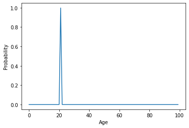

# Age Estimation using KL Divergence 
Age estimation using KL Divergence based learning paradigm. The model uses pretrained VGG16 as backbone.
The pretrained backbone is used to generate embedding from face images that then predict the probability distribution across age range 1-100.
The core idea is to minimize the distance between the predicted distribution and ground truth distribution.

# Installation Guide for Training Model
### Step 0 : Setup and activate conda environment
Create conda environment file using [environment.yml](environment.yml) file. Then activate the environment.
Use the following command :
```angular2html
conda env create -f environment.yml
conda activate age-estimation
```

### Step 1 : Clone the repository.
Copy and paste the following command in the command line to clone the repo locally.
```angular2html
git clone https://github.com/sanket-pixel/age-estimation
cd age-estimation
```
### Step 2 : Edit the config file
Open the [config file](config/age_estimation.json) and edit in accordance with the requirement.
This file contains all important training settings for dataset, model, training, loss, optimizer.

### Step 3 : Start training
Start training the age estimation model by executing the following command.
```angular2html
python3 main.py --config config/age_estimation.json 
```

After this step, the model will be stored inside the [models](models) directory,
within a directory of the name given in the config file. For every run a new directory will be made using the timestamp when the model started training.
This directory contains checkpoints folder which contains ``` best_model.ckpt``` and ```latest_model.ckpt``` . This directory also contains the respective tensorboard logs.
To start the tensorboard run the following command :
```angular2html
tensorboard --logdir=models
```

### Model Evaluation Notebook
The repository also contains the [jupyter notebook](notebooks/model-analytics.ipynb) containing the data
and model evaluation. Specifically, the notebook first visualizes the given data. Then, it picks a sample face image,
to visualize the normalized version and then visualize the predicted probability distribution.
As shown below, the given face image has the age label of 22, and the predicted probability distribution has it's peak at 22.
This imples that the trained model is able to learn the task of predicting probability.

### Age : 22
<p align="left">
  
  
</p>

